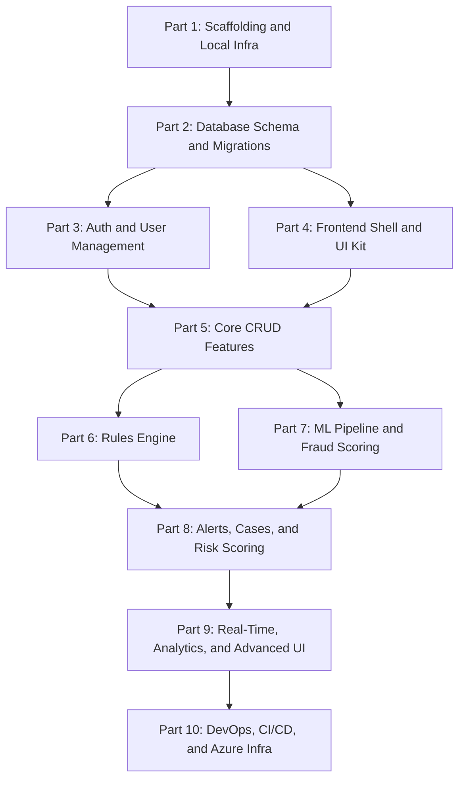

# FinShield AI -- Step-by-Step Build Plan

Break the FinShield AI project into 10 sequential, buildable parts -- each producing a runnable, testable increment. Every part ends with something you can start up, click through, or run tests against before moving to the next.

## Dependency Graph

## Progress Tracker

| Part | Status | Description |
|------|--------|-------------|
| 1 | Pending | Project scaffolding -- Poetry, Next.js init, docker-compose, Makefile, health endpoint |
| 2 | Pending | Database schema -- 12 ORM models, Alembic migrations, seed script |
| 3 | Pending | Auth -- JWT login, RBAC, user CRUD, login page, auth store |
| 4 | Pending | Frontend shell -- Sidebar, topbar, dashboard layout, 20+ UI primitives |
| 5 | Pending | Core CRUD -- Transactions, Entities, Watchlists (backend + frontend + tests) |
| 6 | Pending | Rules Engine -- Condition evaluator, CRUD API, rule builder UI |
| 7 | Pending | ML Pipeline -- Feature engineering, models, ONNX inference, risk scoring |
| 8 | Pending | Alerts and Cases -- Alert lifecycle, case management, notifications, audit |
| 9 | Pending | Real-Time and Analytics -- WebSockets, streaming, charts, network graph |
| 10 | Pending | DevOps -- Terraform, CI/CD pipelines, load tests, production hardening |

---

## Part 1 -- Project Scaffolding and Local Infrastructure

**Goal:** Runnable backend + frontend dev servers with Docker-based Postgres/Redis.

**Backend (`backend/`)**

- Initialize Poetry project (`pyproject.toml`) with core deps: fastapi, uvicorn, sqlalchemy, alembic, pydantic-settings, structlog, python-jose, passlib, celery, redis, httpx
- Create `app/main.py` (FastAPI app entrypoint with CORS, lifespan events)
- Create `app/config.py` (pydantic-settings: DATABASE_URL, REDIS_URL, JWT_SECRET, etc.)
- Create `app/api/router.py` (main router aggregator)
- Create `app/api/v1/health.py` (`GET /api/v1/health` and `GET /api/v1/health/detailed`)
- Create `app/core/exceptions.py` (base exception classes + handlers)
- Create `app/core/middleware.py` (request timing, correlation ID injection)
- Create `backend/.env.example`
- Create `backend/Dockerfile` (multi-stage)

**Frontend (`frontend/`)**

- Initialize Next.js 14 (App Router) with TypeScript, Tailwind CSS
- Install core deps: zustand, @tanstack/react-query, react-hook-form, zod, recharts, socket.io-client, @tanstack/react-table
- Create `src/app/layout.tsx`, `src/app/page.tsx` (redirect to /dashboard)
- Create `src/lib/api-client.ts` (fetch wrapper with base URL from env)
- Create `src/lib/constants.ts`, `src/lib/utils.ts` (cn() helper)
- Create `frontend/.env.local.example`
- Create `frontend/Dockerfile` (multi-stage)

**Root files**

- `docker-compose.yml` (Postgres 16, Redis 7, MailHog)
- `docker-compose.override.yml` (dev volume mounts)
- `Makefile` (dev, backend, frontend, db-migrate, test, lint commands)
- `.gitignore`, `.editorconfig`
- `README.md` (quick-start guide)

**Done when:** `make dev` starts Postgres + Redis + backend (localhost:8000/docs) + frontend (localhost:3000), and `GET /api/v1/health` returns `{"status": "ok"}`.

---

## Part 2 -- Database Schema and Migrations

**Goal:** All 12 core tables created via Alembic migrations, seed script populates test data.

- Create `app/db/session.py` (async engine + session factory)
- Create `app/models/base.py` (BaseModel with id, created_at, updated_at)
- Create all 12 ORM models in `app/models/`:
  - `user.py`, `transaction.py`, `entity.py`, `fraud_alert.py`, `rule.py`, `case.py`, `risk_score.py`, `ml_model.py`, `watchlist.py`, `audit_log.py`, `notification.py`, `webhook.py`
- Configure Alembic (`alembic.ini`, `app/db/migrations/env.py`)
- Generate and run initial migration (all tables, indexes, ENUMs, partitioning for transactions and audit_logs)
- Create `backend/scripts/seed_data.py` (10 users, 5000 entities, 100k transactions, 2000 alerts, 50 cases, 20 rules, 500 watchlist entries)
- Create `app/dependencies.py` (get_db session dependency)

**Done when:** `make db-migrate && make db-seed` populates all tables and `psql` confirms data.

---

## Part 3 -- Authentication and User Management

**Goal:** JWT login, protected routes, RBAC middleware, user CRUD.

**Backend**

- `app/core/security.py` (JWT create/verify, password hashing with bcrypt)
- `app/core/permissions.py` (RBAC decorator/dependency for Admin/Analyst/Investigator/Viewer)
- `app/core/rate_limiter.py` (Redis-backed rate limiting)
- `app/schemas/auth.py` (LoginRequest, TokenResponse, UserResponse)
- `app/schemas/user.py` (UserCreate, UserUpdate, UserList)
- `app/services/auth_service.py` (login, refresh, get_current_user)
- `app/api/v1/auth.py` (POST /login, POST /refresh, GET /me, PUT /me)
- `app/api/v1/users.py` (GET /users, POST /users, PUT /users/{id}, DELETE /users/{id} -- admin only)
- `app/services/audit_service.py` (log user actions)
- Tests: `tests/unit/test_auth.py`, `tests/integration/test_auth_flow.py`

**Frontend**

- `src/app/(auth)/layout.tsx` (centered auth layout)
- `src/app/(auth)/login/page.tsx` (login form with react-hook-form + zod)
- `src/lib/auth.ts` (token storage, auth headers, refresh logic)
- `src/hooks/use-auth.ts` (login, logout, current user)
- `src/stores/auth-store.ts` (Zustand: user, token, isAuthenticated)
- `src/types/user.ts` (User, LoginRequest, TokenResponse types)

**Done when:** Login at localhost:3000/login returns JWT, protected endpoints reject unauthenticated requests, RBAC blocks unauthorized roles.

---

## Part 4 -- Frontend Shell and UI Component Kit

**Goal:** Dashboard layout (sidebar, topbar, breadcrumbs) and reusable UI primitives.

- `src/components/layout/sidebar.tsx` (navigation links for all modules, collapsible)
- `src/components/layout/topbar.tsx` (user avatar, notifications bell, search)
- `src/components/layout/breadcrumbs.tsx`
- `src/app/(dashboard)/layout.tsx` (dashboard shell wrapping sidebar + topbar + content area)
- `src/app/(dashboard)/dashboard/page.tsx` (placeholder overview with stats cards)
- UI primitives in `src/components/ui/`:
  - `button.tsx`, `input.tsx`, `select.tsx`, `badge.tsx`, `card.tsx`, `table.tsx`, `tabs.tsx`, `modal.tsx`, `dialog.tsx`, `dropdown-menu.tsx`, `toast.tsx`, `tooltip.tsx`, `skeleton.tsx`, `progress.tsx`, `avatar.tsx`, `switch.tsx`, `pagination.tsx`, `data-table.tsx` (TanStack Table wrapper)
- Shared components in `src/components/shared/`:
  - `risk-badge.tsx`, `status-indicator.tsx`, `date-range-picker.tsx`, `search-bar.tsx`, `export-button.tsx`, `empty-state.tsx`, `confirmation-dialog.tsx`
- `src/stores/ui-store.ts` (sidebar collapsed, theme)
- `src/styles/theme.ts` (Tailwind theme extensions)
- Query provider setup in root layout (TanStack QueryClientProvider)

**Done when:** Navigating to localhost:3000 shows a polished dashboard shell with sidebar, topbar, and placeholder content. All UI primitives are importable and styled.

---

## Part 5 -- Core CRUD Features (Transactions, Entities, Watchlists)

**Goal:** Three end-to-end feature slices working with real data from the seeded DB.

**Backend -- Transactions**

- `app/schemas/transaction.py`, `app/schemas/common.py` (pagination, filters)
- `app/services/transaction_service.py`
- `app/api/v1/transactions.py` (GET list, GET detail, POST ingest, POST batch, POST search, GET export)

**Backend -- Entities**

- `app/schemas/entity.py`
- `app/services/entity_service.py`
- `app/api/v1/entities.py` (GET list, GET detail/360, GET transactions, GET alerts, GET risk-profile)

**Backend -- Watchlists**

- `app/schemas/watchlist.py`
- `app/services/watchlist_service.py`
- `app/api/v1/watchlists.py` (GET list, POST add, DELETE remove, POST screen, POST import)

**Frontend -- Transactions**

- `src/app/(dashboard)/transactions/page.tsx` (table + filters + pagination)
- `src/app/(dashboard)/transactions/[id]/page.tsx` (detail view)
- `src/components/transactions/` (transaction-table, transaction-filters, transaction-detail-card, fraud-score-indicator)
- `src/hooks/use-transactions.ts`, `src/types/transaction.ts`

**Frontend -- Entities**

- `src/app/(dashboard)/entities/page.tsx` (list)
- `src/app/(dashboard)/entities/[id]/page.tsx` (Entity 360 view)
- `src/hooks/use-entities.ts` (query hooks), `src/types/entity.ts`

**Frontend -- Watchlists**

- `src/app/(dashboard)/watchlists/page.tsx` (list + add form + screen UI)
- `src/types/watchlist.ts`

**Tests:** Integration tests for all API endpoints, 1+ frontend unit test per feature.

**Done when:** You can browse transactions, entities, and watchlists end-to-end with real paginated data, filters, and detail views.

---

## Part 6 -- Rules Engine

**Goal:** Full rules CRUD, condition evaluation engine, dry-run testing, and rule builder UI.

**Backend**

- `app/rules/engine.py` (core evaluator: load rules, evaluate conditions, execute actions)
- `app/rules/conditions.py` (condition types: amount, velocity, geo, time, entity, device, pattern)
- `app/rules/actions.py` (action handlers: block, flag, adjust_risk, create_alert, notify, webhook)
- `app/rules/templates.py` (6 pre-built rule templates)
- `app/schemas/rule.py`
- `app/services/rules_engine_service.py`
- `app/api/v1/rules.py` (CRUD + toggle + test + templates + performance)
- Tests: `tests/unit/test_rules_engine.py` (condition evaluation), integration tests for CRUD

**Frontend**

- `src/app/(dashboard)/rules-engine/page.tsx` (rule list with toggle switches)
- `src/app/(dashboard)/rules-engine/create/page.tsx` (rule builder form)
- `src/app/(dashboard)/rules-engine/[id]/page.tsx` (edit rule)
- `src/components/rules/` (rule-builder, condition-editor, rule-test-panel, rule-list-item)
- `src/hooks/use-rules.ts`, `src/types/rule.ts`

**Done when:** You can create/edit/toggle rules, dry-run them against sample transactions, and see hit counts.

---

## Part 7 -- ML Pipeline and Fraud Scoring

**Goal:** Feature engineering, model training, ONNX inference, risk score aggregation.

**Backend**

- `app/ml/feature_engineering.py` (200+ feature extraction)
- `app/ml/fraud_classifier.py` (XGBoost + NN ensemble)
- `app/ml/anomaly_detector.py` (Isolation Forest + Autoencoder)
- `app/ml/behavioral_profiler.py` (per-entity baseline + deviation)
- `app/ml/network_analyzer.py` (graph centrality, connected components)
- `app/ml/risk_scorer.py` (weighted combination of all scores)
- `app/ml/pipeline.py` (orchestrate: features -> models -> risk score -> decision)
- `app/ml/explainability.py` (SHAP values per prediction)
- `app/ml/model_registry.py` (version, load, promote, retire)
- `app/ml/training/` (train_fraud_model, train_anomaly_model, train_risk_model, evaluate, data_prep)
- `app/schemas/ml_model.py`
- `app/services/ml_service.py`, `app/services/fraud_detection_service.py`, `app/services/risk_scoring_service.py`
- `app/api/v1/models.py` (list, detail, promote, retire, compare, retrain)
- `app/api/v1/risk_scoring.py` (entity profile, history, calculate, distribution, top-risk)
- `backend/scripts/train_models.py` (training orchestrator)
- Tests: unit tests for feature engineering, pipeline, risk scoring

**Frontend**

- `src/app/(dashboard)/ml-models/page.tsx` (model registry)
- `src/app/(dashboard)/ml-models/[id]/page.tsx` (model detail + metrics)
- `src/app/(dashboard)/risk-scoring/page.tsx` (risk dashboard)
- `src/app/(dashboard)/risk-scoring/profiles/[id]/page.tsx` (entity risk profile)
- `src/components/charts/model-performance-chart.tsx`, `risk-distribution-chart.tsx`
- `src/hooks/use-risk-scores.ts`, `src/hooks/use-models.ts`
- `src/types/risk.ts`, `src/types/model.ts`

**Done when:** Ingesting a transaction via POST runs it through the full ML pipeline, produces a fraud score + SHAP explanation, and risk scores are visible on the frontend.

---

## Part 8 -- Fraud Alerts, Case Management, and Notifications

**Goal:** Alert lifecycle, case management, notification system, and audit trail.

**Backend**

- `app/services/fraud_detection_service.py` (wire pipeline output to alert creation)
- `app/schemas/fraud_alert.py`, `app/schemas/case.py`, `app/schemas/audit.py`
- `app/services/case_service.py`, `app/services/notification_service.py`
- `app/api/v1/fraud_alerts.py` (list, detail, status update, assign, escalate, resolve, create-case, statistics)
- `app/api/v1/cases.py` (CRUD, assign, timeline, close, statistics)
- `app/api/v1/audit.py` (list, export)
- `app/models/notification.py` (in-app notifications)
- `app/integrations/email_service.py`, `app/integrations/sms_service.py`
- Tests: integration tests for alert workflow, case lifecycle

**Frontend**

- `src/app/(dashboard)/fraud-alerts/page.tsx` and `[id]/page.tsx`
- `src/app/(dashboard)/case-management/page.tsx` and `[id]/page.tsx`
- `src/app/(dashboard)/audit-log/page.tsx`
- `src/components/fraud/` (alert-card, alert-timeline, investigation-panel, evidence-viewer)
- `src/hooks/use-alerts.ts`, `src/types/alert.ts`, `src/types/case.ts`

**Done when:** Flagged transactions create alerts, analysts can investigate/resolve/escalate, cases link multiple alerts, audit trail logs everything, email notifications fire via MailHog.

---

## Part 9 -- Real-Time Streaming, Analytics, and Advanced UI

**Goal:** WebSocket live updates, Event Hub streaming, analytics dashboards, network graph.

**Backend**

- `app/streaming/websocket_manager.py` (Socket.IO server with /alerts, /transactions, /dashboard namespaces)
- `app/streaming/consumer.py` (Event Hub consumer)
- `app/streaming/producer.py` (Event Hub producer)
- `app/streaming/processor.py` (stream processing: ingest -> pipeline -> emit)
- `app/services/analytics_service.py`
- `app/api/v1/analytics.py` (overview, fraud-trends, transaction-volume, risk-distribution, top-patterns, model-performance, geographic, report generation)
- `app/services/network_analysis_service.py`
- `app/api/v1/network.py` (graph data, entity connections, analyze)
- `app/services/webhook_service.py`
- `app/api/v1/webhooks.py` (CRUD, test delivery)
- `app/api/v1/settings.py` (system config endpoints)
- Celery worker setup (`backend/worker.py`) and scheduled tasks

**Frontend**

- `src/hooks/use-socket.ts`, `src/lib/socket.ts` (Socket.IO client)
- `src/app/(dashboard)/analytics/page.tsx`, `trends/page.tsx`, `patterns/page.tsx`, `reports/page.tsx`
- `src/app/(dashboard)/network-graph/page.tsx`
- `src/app/(dashboard)/settings/` (general, team, integrations, notifications, api-keys)
- `src/components/charts/` (fraud-trend-chart, transaction-volume-chart, geo-heatmap, anomaly-scatter-plot)
- `src/components/network/` (graph-canvas with D3 force layout, node-tooltip, graph-controls)
- `src/components/dashboard/` (stats-card, alert-feed, recent-transactions, risk-gauge, live-activity-ticker)
- `src/hooks/use-analytics.ts`, `src/types/analytics.ts`

**Done when:** Dashboard shows live transaction feed via WebSocket, analytics charts render real data, network graph visualizes entity relationships, settings are configurable.

---

## Part 10 -- Infrastructure, CI/CD, and Production Hardening

**Goal:** Azure deployment-ready with full CI/CD, monitoring, and security hardening.

- `infrastructure/terraform/` (all modules: networking, database, cache, container_apps, event_hubs, storage, monitoring, security, ml, frontdoor, acr)
- `infrastructure/terraform/environments/` (dev.tfvars, staging.tfvars, prod.tfvars)
- `infrastructure/scripts/` (setup-azure.sh, init-terraform.sh, destroy.sh)
- `.github/workflows/ci.yml` (lint + test + build on every PR)
- `.github/workflows/cd-staging.yml` (auto-deploy on merge to main)
- `.github/workflows/cd-production.yml` (manual trigger + blue-green)
- `.github/workflows/infrastructure.yml` (Terraform plan/apply)
- `.github/workflows/ml-pipeline.yml` (data prep, train, evaluate, register)
- `.github/workflows/security-scan.yml` (Dependabot, Semgrep, Gitleaks, Trivy)
- Load testing: `backend/tests/load/locustfile.py` (1000 TPS scenario)
- Security audit: CSP headers, CORS lockdown, rate limit tuning, PII encryption
- Documentation: update `README.md`, `docs/` with final setup instructions

**Done when:** `terraform apply` provisions all Azure resources, GitHub Actions CI passes, staging deployment works end-to-end, load tests confirm <200ms P95.

---

## Summary Table

| Part | What You Get | Depends On |
|------|-------------|------------|
| 1 | Running servers, health endpoint, Docker infra | Nothing |
| 2 | All 12 DB tables with seed data | Part 1 |
| 3 | JWT auth, RBAC, login page | Part 2 |
| 4 | Dashboard shell, 20+ UI components | Part 2 |
| 5 | Transactions + Entities + Watchlists (full CRUD) | Parts 3, 4 |
| 6 | Rules engine with builder UI | Part 5 |
| 7 | ML pipeline, fraud scoring, model registry | Part 5 |
| 8 | Alerts, cases, notifications, audit trail | Parts 6, 7 |
| 9 | WebSockets, analytics, network graph, settings | Part 8 |
| 10 | Terraform, CI/CD, load tests, production deploy | Part 9 |

Parts 3 and 4 can be built in parallel. Parts 6 and 7 can be built in parallel. Everything else is sequential.
